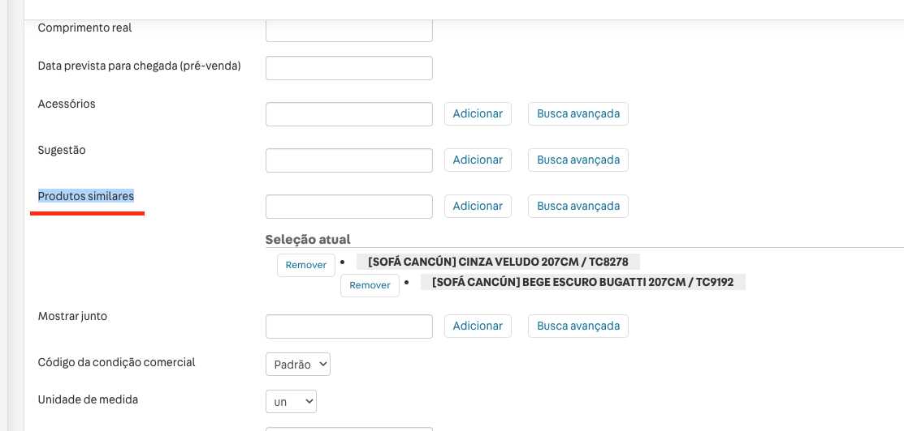

## Desenvolvimento

| Prop name       | Type                | Description                                                                                                  |
| --------------- | ------------------- | ------------------------------------------------------------------------------------------------------------ |
| `pixelId`    | `string`            | id que usar no minicart para abrir ex: <a href="#minicart-pixel">Aqui</a>                                               |
| `label`          | `string`            | Texto do botao |


#### Exemplo de uso
```json
  "buy-together":{
    "props":{
      "pixelId": "openMinicart",
      "label": "compre junto"
    }
  },
```

</br>
</br>

<h3 id="minicart-pixel">Pixel minicart</h3>

exemplo de como e o minicart:

```json
	"minicart.v2": {
    "props": {
      "MinicartIcon": "icon-cart#minicart-icon",
      "customPixelEventId": "openMinicart"
    },
    "children": ["minicart-base-content"]
  }
```

- esse: ```customPixelEventId``` e o mesmo que usamos no botao do compre junto, caso queremos que quando clicar nele abrir o minicart.

-------
</br>

## How use

1. usamos a api de **crossselling** da vtex: [doc](https://help.vtex.com/pt/announcements/lancamos-nossas-novas-apis-de-cross-selling-e-up-selling) 
   esse app esta usando à ```similars``` entao no admin temos que cadastrar os produto em: Produtos similares
  ex:
  

2. Depois disso e so clonar esse app e mudar o **vendor no manifest** e adicionar ele no manifest da sua **storefront** e link esse app e a storefront.
   
   - Nesse app vc precisar mudar o vendor dele, no manisfest desse app: ```"vendor": "vendor-sua-loja"```,

   StoreFront
   - adicionar isso no **manifest** da sua loja, ele vai em ```dependencies``` ficando assim:
   ```json
   "dependencies": {
    "vendor-sua-loja.buy-together": "0.x",
    "vtex.formatted-price": "0.x",
    "..."
    }
   ```
   - adicionar isso no manifest da sua loja na storefront

3. Para o component aparecer vc tem que adicionar no seu blocks o ```"buy-together"```

<br>
<br>

## Blocks


| Blocos | Descricao | Visualização |
| - | - | - |
| `buy-together` | Esse bloco e responsavel por renderizar os produto cadastrado na api de **crossselling** e é capaz de adicionar esse produto no minicart  |  |
